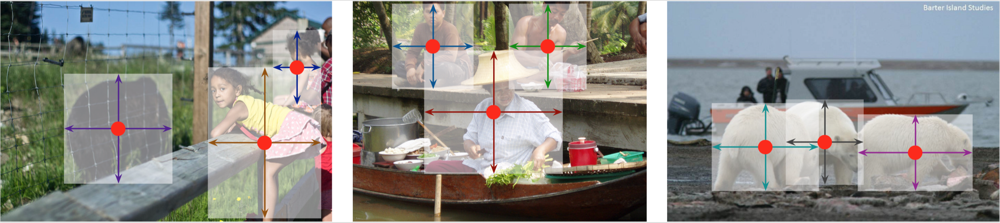

# Hybrid-Supervised Object Detection System  

Object detection system trained by hybrid-supervision/weakly semi-supervision (HSOD/WSSOD):  
This project is based on [CenterNet](https://github.com/xingyizhou/CenterNet).  

***
 

       

Contact: [mukai@buaa.edu.cn](mailto:mukai@buaa.edu.cn). Any questions or discussions are welcomed! 

## Installation

Pleases follow the installation instructions [INSTALL.MD](https://github.com/xingyizhou/CenterNet/blob/master/readme/INSTALL.md) of CenterNet and check your pytorch version.  
**Pytorch=1.4, Cudatoolkit=10.1 is highly recommended.**  
After installation, follow the instructions in [DATA.md](readme/DATA.md) to setup the datasets.

## Getting Started

Run `python start.py ctdet` in *src/* folder, then open `http://127.0.0.1:9766/` in browser.  
Video demo is available at [bilibili](https://www.bilibili.com/video/BV1LU4y1K75W/).

## Training & Testing

- Weakly-supervised training  
`CUDA_VISIBLE_DEVICES=0,1,2,3,4,5,6,7 python -m torch.distributed.launch --nproc_per_node=8 main.py ctdet --dataset=coco80 --arch dlav0camsplit_34 --exp_id camsplit_weak_train --weak --lr_step 30 --num_epochs 50`
- Fully-supervised training  
`CUDA_VISIBLE_DEVICES=0,1,2,3,4,5,6,7 python -m torch.distributed.launch --nproc_per_node=8 main.py ctdet --dataset=coco35 --arch dlav0camsplit_34 --load_model ../exp/ctdet/camsplit_weak_train/model_last.pth --exp_id=camsplit_train --batch_size 64`  
Be aware of setting `self.weak = False` in *src/lib/models/networks/{arch_name}.py*
- Testing on coco val2017 set  
`python test.py ctdet --exp_id coco_test --keep_res --load_model ../exp/ctdet/camsplit_train/model_last.pth --arch dlav0camsplit_34`
- Detection inference of image/folder  
`CUDA_VISIBLE_DEVICES=0 python demo.py ctdet --demo ./images/ --load_model ../exp/ctdet/camsplit_train/model_last.pth --arch dlav0camsplit_34 --nms`

## License

CenterNet itself is released under the MIT License (refer to the LICENSE file for details).
Portions of the code are borrowed from [human-pose-estimation.pytorch](https://github.com/Microsoft/human-pose-estimation.pytorch) (image transform, resnet), [CornerNet](https://github.com/princeton-vl/CornerNet) (hourglassnet, loss functions), [dla](https://github.com/ucbdrive/dla) (DLA network), [DCNv2](https://github.com/CharlesShang/DCNv2)(deformable convolutions), [tf-faster-rcnn](https://github.com/endernewton/tf-faster-rcnn)(Pascal VOC evaluation) and [kitti_eval](https://github.com/prclibo/kitti_eval) (KITTI dataset evaluation). Please refer to the original License of these projects (See [NOTICE](NOTICE)).
